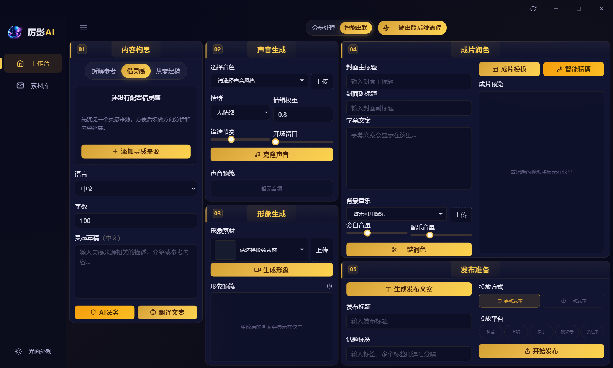

# 厉影AI🚀 AI 口播视频自动化生成工具

> 厉影AI 智能视频创作助手
>
> 一个 本地运行、模块化、可扩展 的
> 口播视频生成与多平台发布自动化工程



---

## 📌 项目简介

厉影AI 专为短视频创作者打造，集成 **云端算力调度**、NLP、语音合成、视频编辑、AI法务审核、多语翻译等核心能力，仅需简单配置，即可一键完成「对标文案提取→文案仿写→声音克隆→视频合成→字幕/背景音乐添加→标题/封面生成→多平台发布」全链路自动化。**无需高性能本地设备支撑，低配电脑也能轻松驾驭**，让你从繁琐的视频制作流程中解放出来，专注于内容策略，轻松批量产出爆款口播视频。

---

## 支持一键自动产出爆款视频

- 1.自动提取对标文案
- 2.自动进行文案仿写
- 3.自动根据文案声音克隆
- 4.自动合成口播视频
- 5.自动添加字幕
- 6.自动添加背景音乐
- 7.自动添加视频标题
- 8.自动生成视频封面
- 9.自动将视频发布到各平台

---

## ✨ 功能特性

* 自动提取并处理对标视频口播文案
* 文案语义级仿写与结构重组
* AI法务合规审核
* 多语翻译文案
* 高保真语音克隆与合成
* 自动生成字幕、背景音乐、标题与封面
* 多平台视频自动发布
* 全流程本地运行，无云端依赖

---

## 🧠 自动化流程

```text
对标文案提取
        ↓
文案仿写与优化
        ↓
AI法务审核 / 翻译文案
        ↓
语音合成 / 声音克隆
        ↓
视频合成
        ↓
字幕 / BGM / 封面合成
        ↓
多平台发布
```

---

## 🧩 项目结构

项目采用 **Electron + React** 架构，模块化设计，各功能解耦：

```text
project-root/
├── src/
│   ├── main/                # Electron 主进程
│   │   ├── index.ts         # 入口文件
│   │   ├── local-server.ts  # 本地文件服务器
│   │   └── ipc-handlers/    # IPC 处理器
│   ├── preload/             # 预加载脚本
│   └── renderer/            # React 渲染进程
│       └── src/
│           ├── api/         # API 服务层
│           ├── store/       # Zustand 状态管理
│           ├── pages/       # 页面组件
│           └── components/  # 通用组件
├── ffmpeg/bin/              # FFmpeg 二进制
├── assets/                  # 静态资源
│   ├── bgms/               # 背景音乐
│   ├── fonts/               # 字体文件
│   └── title-styles/        # 标题样式
└── channels/                # 渠道配置
```

---

## 🔧 技术栈

| 模块     | 技术方案                  |
| -------- | ------------------------- |
| 桌面框架 | Electron 38               |
| UI 框架  | React 19 + TypeScript     |
| 构建工具 | Vite (electron-vite)      |
| 状态管理 | Zustand                   |
| 样式方案 | TailwindCSS 4             |
| 视频处理 | FFmpeg                    |
| 自动发布 | Playwright 浏览器自动化   |

---

## 📦 安装说明

> 由于模型文件及依赖体积较大，项目资源拆分提供。

1. **下载项目源码**
   详见：`代码地址.txt`

2. **安装运行环境**
   按照：`使用前必装.txt` 进行依赖安装

3. **安装依赖**
   ```bash
   pnpm install
   ```

4. **启动本地客户端**
   ```bash
   pnpm dev
   ```

---

## ▶️ 使用方式

当前版本通过 **本地客户端** 控制完整流水线，基本使用流程如下：

1. 配置对标内容或原始文案
2. 执行文案仿写模块
3. 可选：AI法务审核 / 翻译文案
4. 选择语音进行声音克隆
5. 生成口播视频
6. 自动完成字幕、BGM、封面
7. 选择平台进行发布

---

## 🧪 设计原则

* **本地优先**：不依赖云端服务
* **模块解耦**：各模块可独立替换
* **流程可控**：每一步可单独调试
* **工程导向**：强调稳定性与可维护性

---

## 📖 联系交流

> 可联系交流wx：


---

## ⚠️ 注意事项

* 需要 FFmpeg 二进制文件放在 `ffmpeg/bin/` 目录
* 需要 Chrome 浏览器放在 `chrome/` 目录用于平台发布自动化
* 构建打包命令：`pnpm build:win`

---

## ⚠️ 已知限制

* 对硬件资源（尤其是GPU）有一定要求
* 不同平台上传接口可能存在波动
* 数字人口广播效果依赖上游模型质量

---

## 🤝 致谢

本项目基于以下优秀项目与工具构建，特此开源表示感谢：

* [耳语](https://github.com/openai/whisper)
* [CosyVoice](https://github.com/FunAudioLLM/CosyVoice)
* [HeyGem](https://github.com/GuijiAI/HeyGem.ai)
* [社交自动上传](https://github.com/dreammis/social-auto-upload)
* FFmpeg

---

## 📄 使用限制与声明

* 本项目 **仅用于个人学习、研究和技术交流**
* 🚫 禁止任何形式的商业用途
* 🚫 禁止基于本项目提供付费服务或二次分发
* 使用本项目产生的内容与风险由使用者自行承担

---

## 📖 About

本仓库展示了一个 **完整、可运行的 AI 口播视频自动化工程实现**，侧重 **系统集成与工程实践**。

适用于：

* AI 视频方向技术学习
* 口播视频系统原型验证
* 自动化内容生成流程研究

---
